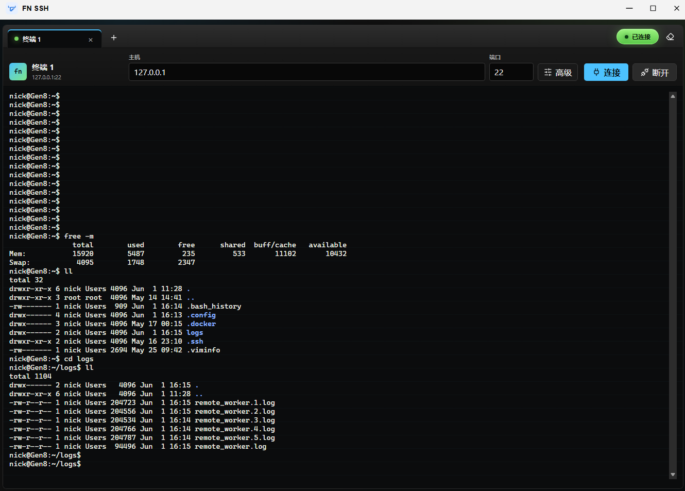

# FN SSH Console



开源地址：https://github.com/qdog2012/fnssh

一个用 Go 实现的 Web SSH 终端。浏览器使用 xterm.js，后端通过 WebSocket 转发到 SSH 会话。支持：

- 本地 SSH：默认连接 `127.0.0.1:22`
- 远程 SSH：手动输入主机和端口
- 多终端会话：每个终端 tab 独立 WebSocket 和 SSH session
- 密码认证和 OpenSSH 私钥认证
- 终端 resize、清屏、断开连接

## 运行

```bash
go mod tidy
go run .
```

默认监听：

```text
http://NAS_IP:5123
```

如果部署在飞牛 NAS 上，建议先用浏览器直连 `http://NAS_IP:5123` 测试，再考虑反向代理。

## 环境变量

| 变量 | 默认值 | 说明 |
| --- | --- | --- |
| `FNSSH_ADDR` | `:5123` | Web 服务监听地址 |
| `FNSSH_LOCAL_HOST` | `127.0.0.1` | 本地模式连接的 SSH 主机 |
| `FNSSH_LOCAL_PORT` | `22` | 本地模式连接的 SSH 端口 |
| `FNSSH_TOKEN` | 空 | 设置后 WebSocket 连接必须带访问令牌 |
| `FNSSH_ALLOWED_HOSTS` | 空 | 逗号分隔的允许连接主机；空表示不限制 |
| `FNSSH_KNOWN_HOSTS` | 空 | known_hosts 文件路径；空时跳过主机指纹校验 |
| `FNSSH_ALLOW_ORIGIN` | 空 | 指定允许的 WebSocket Origin；`*` 表示放开 |
| `FNSSH_DIAL_TIMEOUT_SECONDS` | `15` | SSH 连接超时 |

## Docker

```bash
docker build -t fnssh .
docker run --rm -p 5123:5123 \
  -e FNSSH_TOKEN=change-me \
  -e FNSSH_LOCAL_HOST=192.168.1.10 \
  fnssh
```

如果容器没有使用 host 网络，`127.0.0.1` 指的是容器自身，不是 NAS 主机。此时把 `FNSSH_LOCAL_HOST` 设置为 NAS 的局域网 IP，或使用 host 网络。

## 飞牛 FPK

当前目录已经生成 `fnssh.fpk`，可以在飞牛应用中心里手动安装。

这个包是原生 x86_64 应用，安装后监听 `5123` 端口，桌面入口以 iframe 方式嵌入飞牛 WebUI：

```text
http://NAS_IP:5123
```

本地 SSH 模式默认连接 NAS 自身的 `127.0.0.1:22`，需要先在飞牛里启用 SSH 服务。

## 安全注意

这是远程命令执行入口。不要直接暴露到公网。源码运行或自定义打包时建议设置 `FNSSH_TOKEN`，并优先通过内网、VPN 或可信反代访问。当前 FPK 包默认不启用 token，适合可信内网测试。

默认没有启用 SSH 主机指纹校验，适合内网快速测试。生产使用时请设置 `FNSSH_KNOWN_HOSTS`。
